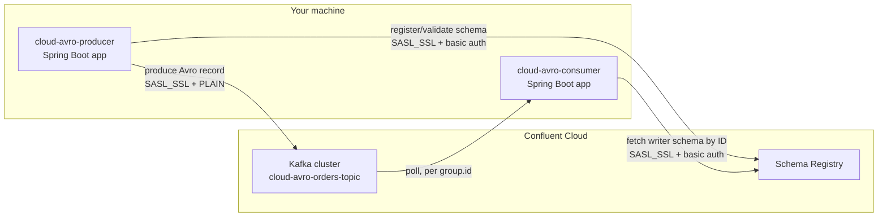

# Cloud Avro Consumer — Learning Project

A Spring Boot Avro consumer that reads from **Confluent Cloud** (a managed
Kafka + Schema Registry service) instead of a local broker — the consumer
half of the pair started with
[`cloud-avro-producer`](https://github.com/DuminduChamal/cloud-avro-producer).
The listener container keeps the app running indefinitely, same as every
other consumer project in this series — no REST layer needed here.

## Architecture



Both apps run either directly on your machine (`mvn spring-boot:run`) or
as Docker containers — both reach Confluent Cloud identically, over the
public internet, using the same environment-variable-supplied credentials.
No local Kafka broker or Schema Registry is involved at all.

## Prerequisites

- **Java 17+**
- **Maven**
- **The same Confluent Cloud cluster** `cloud-avro-producer` uses — same
  cluster, same Schema Registry, same topic (`cloud-avro-orders-topic`),
  same six credential values

## Configuration

`src/main/resources/application.properties` — consumer-side counterpart
to the producer's environment-variable-driven config:

```properties
spring.kafka.bootstrap-servers=${BOOTSTRAP_SERVERS}
spring.kafka.properties.security.protocol=SASL_SSL
spring.kafka.properties.sasl.mechanism=PLAIN
spring.kafka.properties.sasl.jaas.config=org.apache.kafka.common.security.plain.PlainLoginModule required username="${CLUSTER_API_KEY}" password="${CLUSTER_API_SECRET}";
spring.kafka.consumer.group-id=cloud-avro-consumer-group
spring.kafka.consumer.auto-offset-reset=earliest
spring.kafka.consumer.key-deserializer=org.apache.kafka.common.serialization.StringDeserializer
spring.kafka.consumer.value-deserializer=io.confluent.kafka.serializers.KafkaAvroDeserializer
spring.kafka.properties.schema.registry.url=${SCHEMA_REGISTRY_URL}
spring.kafka.properties.basic.auth.credentials.source=USER_INFO
spring.kafka.properties.basic.auth.user.info=${SR_API_KEY}:${SR_API_SECRET}
spring.kafka.properties.specific.avro.reader=true
```

`specific.avro.reader` isn't a native Spring Boot property key — like
`schema.registry.url` and `basic.auth.*`, it's passed through as a raw
Kafka client config via `spring.kafka.properties.*`.

Create a `.env` file in the project root (never committed) with the same
six values as `cloud-avro-producer`'s `.env`:

```
BOOTSTRAP_SERVERS=pkc-xxxxx.region.provider.confluent.cloud:9092
CLUSTER_API_KEY=your-cluster-api-key
CLUSTER_API_SECRET=your-cluster-api-secret
SCHEMA_REGISTRY_URL=https://psrc-xxxxx.region.provider.confluent.cloud
SR_API_KEY=your-sr-api-key
SR_API_SECRET=your-sr-api-secret
```

## The schema — namespace must match the producer exactly

`src/main/avro/OrderEventAvro.avsc`'s `namespace` is `com.learning.kafka.dto`
— identical to `cloud-avro-producer`'s copy. Both projects are a
self-contained pair with no other consumer to stay compatible with, unlike
the local-broker projects (where the generated class stays at the root
package for that reason — see `producer-demo`'s README). `specific.avro.reader=true`
resolves the target class from the writer's schema via
`Class.forName(namespace + "." + name)`; a namespace mismatch between the
two projects would break deserialization entirely.

## The listener

```java
@Component
public class AvroOrderEventListener {

    @KafkaListener(topics = "cloud-avro-orders-topic")
    public void listen(ConsumerRecord<String, OrderEventAvro> record) {
        OrderEventAvro order = record.value();
        System.out.printf("partition=%d offset=%d key=%s order=%s%n",
                record.partition(), record.offset(), record.key(), order);
    }
}
```

No `groupId` in the annotation — `spring.kafka.consumer.group-id` is set
globally, and this project only has one listener, unlike
`spring-consumer-demo`'s several competing ones. Binds to
`ConsumerRecord<String, OrderEventAvro>` rather than the bare value, the
same choice `spring-consumer-demo`'s `OrderEventWithMetadataListener` made,
so partition/offset/key print alongside the deserialized object.

## Running it

### Locally

```bash
export $(grep -v '^#' .env | xargs)
mvn compile
mvn spring-boot:run
```

### From IntelliJ

Run `CloudAvroConsumerApplication`, with the **EnvFile** plugin configured
on its Run Configuration pointing at this project's `.env` — no terminal
needed, same setup as the producer.

Either way, it starts, joins `cloud-avro-consumer-group`, and (since
`auto.offset.reset=earliest`) immediately prints anything already sitting
in `cloud-avro-orders-topic`, then keeps running and prints new messages
live as `cloud-avro-producer` sends them.

## What's next

- Containerizing this app with a multi-stage `Dockerfile`, same pattern as
  planned for the producer
- Docker Compose to run both together with one command
